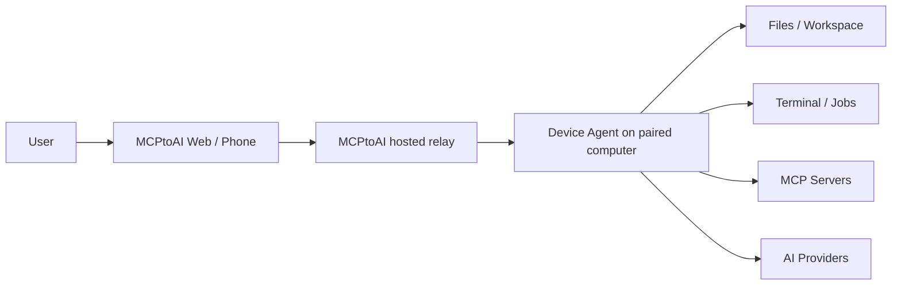

<div align="center">
  

# MCPtoAI

**Let the AI model you choose work with your own computer and MCP tools — under device-side control.**

[](https://mcptoai.com)
[](https://mcptoai.com/downloads/)
[](LICENSE)
[](SECURITY.md)
[](https://github.com/mcptoai/MCPtoAI/actions/workflows/client-ci.yml)

[Website](https://mcptoai.com) · [Web App](https://app.mcptoai.com) · [Downloads](https://mcptoai.com/downloads/) · [Demo](https://youtu.be/nAhHaHcHs1U)

</div>

---

## What MCPtoAI does

Most AI chats stop at the conversation. MCPtoAI lets the model you choose work with a paired computer and connected MCP services while keeping local capabilities behind permissions you control on the device.

With MCPtoAI you can:

- work with files inside the locations you allow;
- run terminal commands when terminal access is enabled;
- connect MCP servers and use their tools in the same workflow;
- switch AI providers without starting a new conversation;
- keep provider credentials on your own device;
- choose whether conversation history is stored in MCPtoAI Cloud or only on the selected device;
- use the web app from another browser or phone while the paired device stays in control of local actions.

> **Available now:** macOS 13+ on Apple silicon, Windows 10+ (x64), Linux CLI 0.1.15 and the official Docker image.

## See it in action

[▶ **Watch the MCPtoAI demo on YouTube**](https://youtu.be/nAhHaHcHs1U)

The demo shows the complete path from installation and device pairing to provider setup, model switching, device-only history and an AI tool call on the paired computer.

## Get started in three steps

### 1. Install MCPtoAI

Download the signed installer from:

**https://mcptoai.com/downloads/**

- **macOS:** signed, notarized and distributed for Apple silicon.
- **Windows:** signed installer for x64 systems.
- **Linux CLI:** `python3 -m pip install mcptoai==0.1.15`
- **Docker:** `docker pull ghcr.io/mcptoai/mcptoai:0.1.15`

### 2. Pair your computer

On macOS or Windows, open MCPtoAI Desktop and connect your account. On Linux, run `mcptoai login` after installing the CLI, or run the equivalent command inside the Docker container. The device-side agent authenticates the computer and handles local capabilities.

### 3. Add a provider and make the first tool call

Add the provider you want to use, configure the local permissions you are comfortable with, then open MCPtoAI Web and ask the model to perform a task on the paired computer.

A useful first test is:

> Show me the largest files in my Downloads folder.

The exact tools available depend on platform, local permissions and the MCP servers you connect.

## Why MCPtoAI

| | MCPtoAI |
| --- | --- |
| **Bring your own model/provider** | Use supported cloud providers or local model setups. |
| **Device-side control** | Local capabilities are governed by the permissions configured on the paired computer. |
| **Provider credentials** | Stored on the user's device rather than MCPtoAI servers. |
| **MCP support** | Connect MCP servers and expose their tools through the same workspace. |
| **Remote access** | Use MCPtoAI Web from another browser or phone while execution stays on the paired device. |
| **History choice** | Store conversation history in MCPtoAI Cloud or only on the selected device. |

## How it fits together



The hosted service coordinates authenticated sessions and relays traffic between the web app and the paired device. Local actions are executed by the Device Agent and remain subject to the permissions configured on that computer.

MCPtoAI does **not** currently provide end-to-end encryption. Traffic between components is protected in transit using TLS.

## Security and privacy model

MCPtoAI is designed around local control rather than unrestricted remote execution.

- Provider API keys stay on the user's computer in the supported credential store (Keychain on macOS, Windows Credential Manager on Windows, and the supported local credential store on Linux).
- Filesystem access is limited to the workspace and locations permitted on the device.
- Terminal access can be disabled locally.
- High-impact actions require live approval; other tools follow the configured Off / Ask / Allow policy.
- Device connections are authenticated and signed with device-specific keys.
- Device-only conversation history is kept on the selected device and is not persisted in MCPtoAI Cloud.
- Release artifacts are delivered through the official MCPtoAI update and download endpoints.

For vulnerability reporting and supported security versions, read [SECURITY.md](SECURITY.md).

## Repository scope

The MCPtoAI clients are open source. The hosted web app, relay and production infrastructure are operated by BKTY LTD and are not part of this repository.

```text
desktop/        Electron Desktop app for macOS and Windows
device-agent/   Device Agent bundled with the Desktop app (macOS and Windows)
linux-agent/    Terminal-only Linux CLI, published on PyPI as `mcptoai`
docs/           Threat model and history provider design
```

Start with the [threat model](docs/THREAT_MODEL.md) to see what MCPtoAI protects, where the trust boundaries are and which security invariants the clients enforce.

## Development

Device Agent (Python 3.11+):

```bash
cd device-agent
python3 -m venv .venv
.venv/bin/pip install -e . pytest
.venv/bin/python -m pytest -q
```

Desktop app (Node.js). In development mode it uses the Device Agent from `device-agent/.venv`:

```bash
cd desktop
npm install
npm start
```

Linux CLI:

```bash
cd linux-agent
python3 -m venv .venv
.venv/bin/pip install -e . pytest
.venv/bin/python -m pytest -q
```

Signed and notarized release builds require maintainer-only credentials and are not expected for normal contributions.

See [CONTRIBUTING.md](CONTRIBUTING.md) for contribution guidelines.

## Project status

MCPtoAI is under active development in the `0.x` series. Interfaces, packaging and supported integrations may continue to evolve.

For current installers and installation instructions, always use:

**https://mcptoai.com/downloads/**

## Support and feedback

- Use **GitHub Issues** for reproducible bugs and feature requests.
- Do **not** open public issues for suspected vulnerabilities; follow [SECURITY.md](SECURITY.md).
- Product information and downloads are available at [mcptoai.com](https://mcptoai.com).

## License

The source code in this repository is licensed under the [MIT License](LICENSE).

MCPtoAI™ is a trademark of **BKTY LTD**. The MIT License covers the source code in this repository; it does not grant rights to use the MCPtoAI name or logo.
