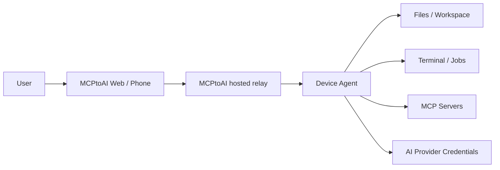

<div align="center">

# MCPtoAI

**Connect AI models to your own computer and MCP tools — while keeping control on your device.**

[Website](https://mcptoai.com) · [Web App](https://app.mcptoai.com) · [Downloads](https://mcptoai.com/downloads/)

</div>

## Demo

[▶ Watch the MCPtoAI demo on YouTube](https://youtu.be/nAhHaHcHs1U)

See MCPtoAI install, pair a device, switch AI providers, keep history on-device, and let AI work with files on your computer.

## What is MCPtoAI?

MCPtoAI is a cross-platform bridge between AI models and the computer you already use. It combines a desktop app, a local Device Agent and MCP support so AI can work with local capabilities such as files, terminal commands and connected MCP servers under user-controlled permissions.

This repository contains the source of the MCPtoAI Desktop app. The Device Agent is distributed as a signed binary with the Desktop installer, and the hosted MCPtoAI web service and relay are operated separately by BKTY LTD.

## Why MCPtoAI?

Many AI tools are powerful but stop at the browser. MCPtoAI is designed to make the user's own machine part of the workflow without turning that machine into an uncontrolled remote shell.

- **Cross-platform** — macOS and Windows today; Linux and Docker coming soon.
- **Local control** — device-side permissions decide what AI can access.
- **Bring your own provider** — provider credentials are configured on the user's device.
- **MCP support** — connect MCP servers and expose their tools through the same workflow.
- **Web and phone access** — use the MCPtoAI web app from a browser while the paired device stays under local control.
- **Desktop app** — set up permissions, providers and tools from a graphical app; a terminal-only Linux CLI is coming soon.

## Quick start

### macOS and Windows

Download the signed desktop installer from:

**https://mcptoai.com/downloads/**

The Desktop app includes the Device Agent and guides you through installation, account pairing, provider setup and optional operating-system permissions.

### Linux and Docker

Coming soon: a terminal-only Linux CLI and a Docker image. Watch this repository or follow
[mcptoai.com](https://mcptoai.com) for the release.

## Core capabilities

The exact tools available depend on platform, permissions and the MCP servers you connect. MCPtoAI is built around these capabilities:

- Pair a computer with an MCPtoAI account.
- Use supported AI providers and models.
- Keep provider credentials in the device-side credential/vault layer.
- Expose a user-selected filesystem workspace.
- Allow or block terminal-command execution locally.
- Connect and manage MCP servers.
- Run long-running jobs.
- Use MCPtoAI from the web, a phone browser or the Desktop app.
- Update the Desktop/Agent through the supported release channels.

## How it fits together



The hosted service coordinates authenticated sessions. Sensitive local actions are executed by the Device Agent on the paired machine, subject to the permissions configured there.

## Security model

MCPtoAI is intentionally permission-oriented:

- Local filesystem access is scoped to the configured workspace.
- Terminal access can be enabled or disabled on the device.
- Optional OS permissions are requested only for capabilities that need them.
- Provider keys stay on the user's machine. On macOS and Windows they are kept in the operating system's credential store.
- Conversation history can be kept on MCPtoAI Cloud or only on the device.
- Release artifacts are distributed through the official MCPtoAI release endpoints.

Please read [SECURITY.md](SECURITY.md) before reporting a vulnerability.

## Repository layout

```text
desktop/   Electron Desktop app (UI, main process, agent installer and updater)
```

This repository is the Desktop app's source. It does not contain the Device Agent, the hosted
web application, the relay or production infrastructure, so the Desktop app cannot be built
into a working product from this repository alone. To use MCPtoAI, install the signed release
from the download page.

## Project status

MCPtoAI is under active development. Interfaces, commands and packaging may still evolve while the project is in the `0.x` release series.

For current installers and installation instructions, use the official download page rather than relying on filenames in the source tree:

**https://mcptoai.com/downloads/**

## Contributing

Bug reports, feature proposals and integration requests are welcome. Please read [CONTRIBUTING.md](CONTRIBUTING.md) first.

## License

The source code in this repository is licensed under the [MIT License](LICENSE).

MCPtoAI™ is a trademark of **BKTY LTD**. The MIT License covers the source code in this repository; it does not grant rights to use the MCPtoAI name or logo.
